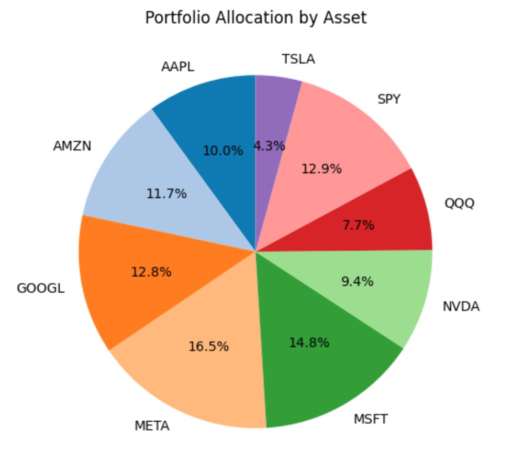
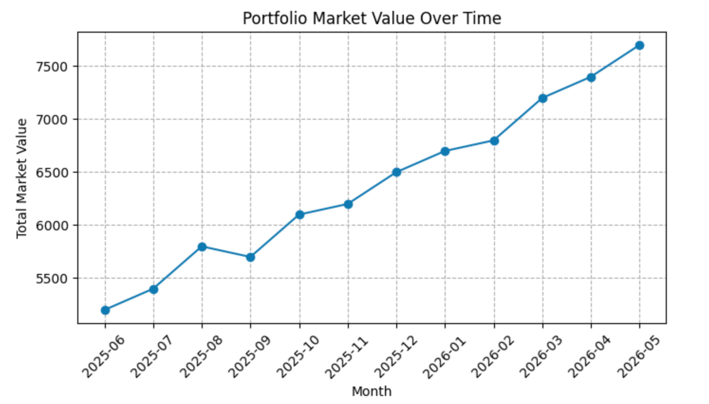
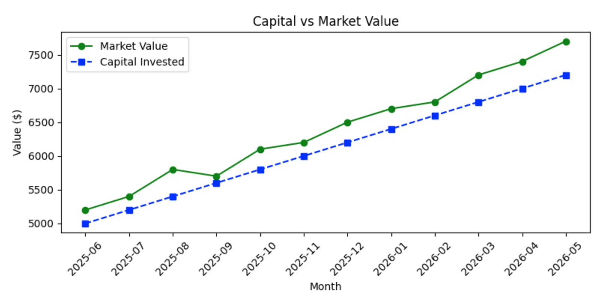

# Personal Investment Tracker (Python) 

## Overview
The **Personal Investment Tracker** is a Python-based tool designed to help investors **monitor and analyse their stock portfolio** over time. It reads transaction data from a CSV, calculates detailed holdings and portfolio-level metrics, and provides **visual insights** through charts.

This project demonstrates practical **data analytics, Python programming, financial calculations, and visualisation skills**. A greater focus is placed on **clarity, correctness, and usability** rather than **advanced quantitative modelling**. 

## Motivation
This project was built to create a **structured, data-driven approach to portfolio tracking** while applying core concepts in **Python, finance, and data analysis** to a real-world use case.

## Features

### Portfolio Analytics
- Computes detailed per-asset and portfolio-level metrics
- Provides **capital invested, market value, unrealised P/L, and weights**
- Tracks portfolio growth and allocation over time

### Historical Tracking
- Stores **monthly snapshots** automatically
- Supports trend analysis and visual reporting

### Visual Insights
- **Pie charts** for allocation
- **Bar charts** for unrealised P/L
- **Line charts** for portfolio value and capital vs. market value

### Robust & Extensible
- Handles CSV data automatically
- Converts numeric columns explicitly to prevent type issues
- Parameterised snapshot function provides flexibility
- Designed to be easily scalable

## Design Decisions
- Transaction-driven architecture ensures all metrics are reproducible from raw data
- Monthly snapshots are stored separately to preserve historical portfolio states
- Visualisations prioritise clarity and interpretability over complexity

## How to Use
1. Clone the repository
   ```
   git clone https://github.com/cjj895/python-investment-tracker.git
2. Install dependencies
   ```bash
   pip install pandas matplotlib yfinance
3. Update [transactions_sample.csv](transactions_sample.csv) with your own transactions (or use the provided sample file)
4. Open and run [investment_tracker.ipynb](investment_tracker.ipynb) in Jupyter Notebook
5. View detailed holdings, portfolio metrics, and visualisations.
6. Optionally, save a monthly snapshot automatically to track historical performance

## Visual Outputs
- Pie chart of portfolio allocation
- Bar chart of unrealised P/L
- Line chart of portfolio value over time






## Future Improvements
- Add **realised P/L** per asset
- Implement **Time-Weighted Return (TWR)** and benchmarking against market indices
- Extend support for **non-US stocks**
- Interactive dashboards and advanced visualisations
- Automated testing framework

## Skills & Tech Stack
- **Python** - modular scripting and financial computations
- **Pandas** - data cleaning, aggregation, and analysis
- **Matplotlib** - portfolio visualisation
- **yfinance** - live market data integration
- **CSV & os** - data persistence and file handling

